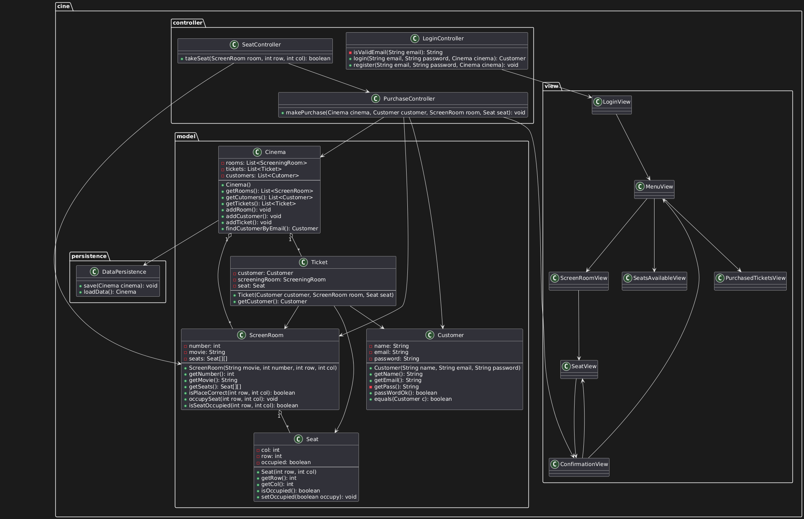
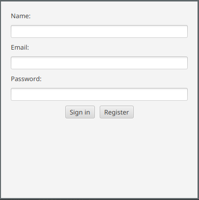
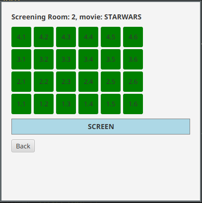

# 🌐 Idioma / Language  
> 📌 **Selecciona tu idioma:**  
> - [🇪🇸**Español**](README.es.md) (actual)  
> - [🇬🇧English](README.md)  
---

# 🎬 Sistema de Venta de Entradas de Cine

## Descripción
Sistema desarrollado para gestionar la venta de entradas de cine. Permite a los usuarios:

- Registrarse o iniciar sesión como cliente.
- Ver las salas disponibles y el estado de sus asientos (libres/ocupados).
- Comprar entradas para funciones específicas.
- Persistir el estado del sistema (salas, asientos y clientes) mediante serialización.

---

## 🧱 Clases Principales

### Dominio:
- **Customer**: nombre, email, contraseña.
- **Seat**: número, fila, estado (ocupado/libre).
- **ScreeningRoom**: número, película, matriz de asientos.
- **Ticket**: cliente, sala, asiento.
- **Cinema**: contiene una lista de salas y tickets.

---

## 💾 Persistencia:
- **DataPersistence**: métodos para guardar y cargar objetos con serialización.
- **Interfaz JavaFX**:
  - Pantalla de login y registro.
  - Selección de sala y película.
  - Visualización de asientos.
  - Confirmación de compra.
  - (Opcional) Resumen de tickets adquiridos.

> ⚠️ **IMPORTANTE**  
> Al cerrar la aplicación, el estado del cine se guarda en `cine.ser`.  
> Si existe un archivo previo, el estado se recupera automáticamente al iniciar.

---

## 📁 Estructura de Paquetes Sugerida

```plaintext
cine/
├─ model/
│  └─ Customer, ScreeningRoom, Seat, Ticket, Cinema
├─ view/
│  └─ LoginView, RoomView, etc.
├─ controller/
│  └─ Lógica de login, compra y navegación
└─ persistence/
   └─ DataPersistence.java
```


### 📐 Diagrama UML
Este diagrama muestra la estructura general del sistema:


### 🔐 Pantalla de Inicio de Sesión
Pantalla donde los usuarios pueden registrarse o iniciar sesión.


### 🎟️Vista de Selección de Asientos
Vista de una sala con asientos ocupados y libres.


