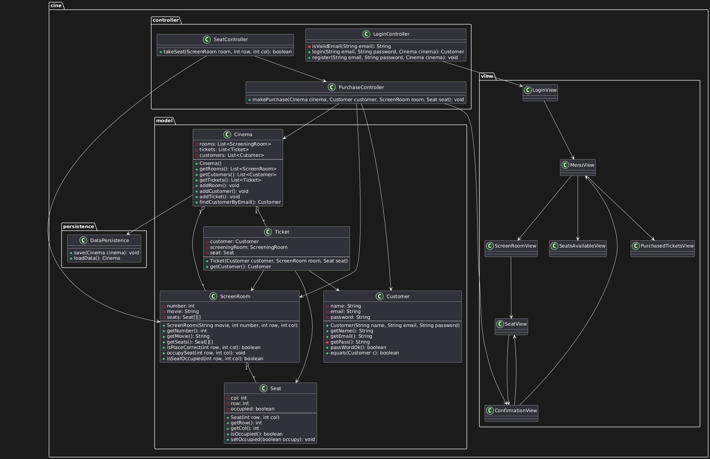
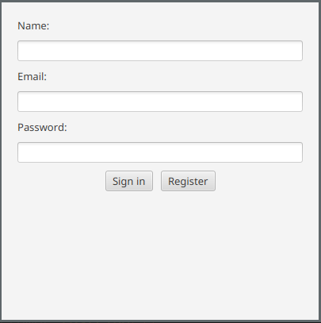

# 🌐 Idioma / Language  
> 📌 **Select your language:**  
> - [🇪🇸Español](README.es.md)  
> - [🇬🇧**English**](README.md) (current)  
---


 🎬 Cinema Ticket Sales System
======
## Develop a cinema ticket sales system that allows users to:
- Register or log in as a customer.
- View available screening rooms and their status (free/occupied seats).
- Purchase tickets for selected screenings.
- Persist the system state (rooms, occupied seats, and customers) through serialization.

## Main Classes
* Domain:
  - Customer: name, email, password.
  - Seat: number, row, status (occupied/free).
  - ScreeningRoom: number, movie, seat matrix.
  - Ticket: customer, screening room, seat.
  - Cinema: contains a list of screening rooms and tickets.

# Persistence:
* DataPersistence: methods to save and load objects using serialization.
* JavaFX Interface
* Login/Registration screen.
* Screening room and movie selection screen.
* Seat visualization (free/occupied).
* Purchase confirmation.
* Optional: Summary of purchased tickets.

> [!IMPORTANT]
> When closing the application, the cinema state is saved (cine.ser).
> 
> On startup, the state is recovered if it exists.

# Suggested Package Structure
```console
cine/
├─ model/
├  → Customer, ScreeningRoom, Seat, Ticket, Cinema
├─ view/
├  → JavaFX Windows (LoginView, RoomView, etc.)
├─ controller/ 
├  → Login, purchase, and navigation logic
└─ persistence/ 
   → DataPersistence.java
```

# Development Steps

* Model the domain classes.
* Design the system state persistence.
* Implement business logic (purchases, login).
* Develop the GUI with JavaFX.
* Integrate everything using MVC.


### 📐 UML Diagram
This diagram shows the class structure of the system.


### 🔐 Login Screen
The interface where users can register or log into the system.


### 🎟️ Seat Selection View
Displays the status of seats (free/occupied) in a screening room.


